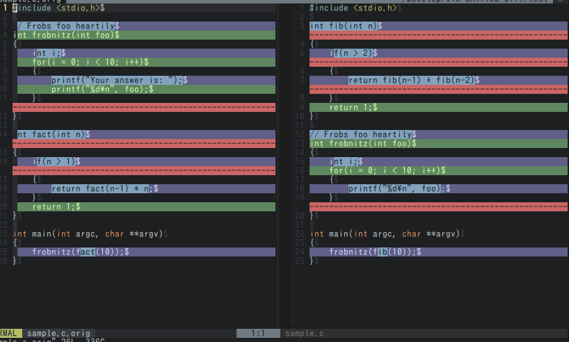
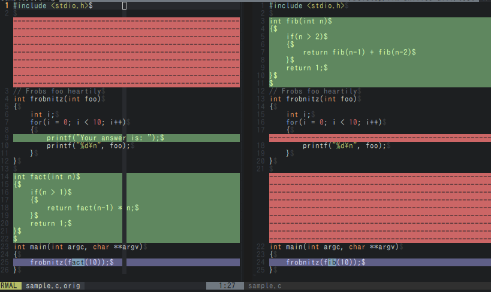

vim-unified-diff [](https://travis-ci.org/lambdalisue/vim-unified-diff)
==============================================================================

A library for using diff programs which only support *unified diff* (i.e. `git diff`) in `vimdiff`

- Version:  0.1.0
- Author:   Alisue <lambdalisue@hashnote.net>
- Support:  Vim 7.3 and above


INTRODUCTIONS
==============================================================================
This plugins was built mainly for using `git diff --histogram` in `vimdiff`. The following screenshot is a diff mode with vim builtin `diffexpr`



It will be turn into



via `git diff --histogram` and *vim-unified-diff*

Inspired by http://qiita.com/takaakikasai/items/3d4f8a4867364a46dfa3 and written in pure vimscript.

INSTALL
==============================================================================

```vim
NeoBundle 'lambdalisue/vim-unified-diff'
```

USAGE
==============================================================================

```vim
set diffexpr=unified_diff#diffexpr()

" configure with the followings (default values are shown below)
let unified_diff#executable = 'git'
let unified_diff#arguments = [
      \   'diff', '--no-index', '--no-color', '--no-ext-diff', '--unified=0',
      \ ]
let unified_diff#iwhite_arguments = [
      \   '--ignore-all-space',
      \ ]
```

LICENSE
==============================================================================

MIT license

    Copyright (c) 2014 Alisue, hashnote.net

    Permission is hereby granted, free of charge, to any person obtaining
    a copy of this software and associated documentation files
    (the "Software"), to deal in the Software without restriction,
    including without limitation the rights to use, copy, modify, merge,
    publish, distribute, sublicense, and/or sell copies of the Software,
    and to permit persons to whom the Software is furnished to do so,
    subject to the following conditions:

    The above copyright notice and this permission notice shall be
    included in all copies or substantial portions of the Software.

    THE SOFTWARE IS PROVIDED "AS IS", WITHOUT WARRANTY OF ANY KIND,
    EXPRESS OR IMPLIED, INCLUDING BUT NOT LIMITED TO THE WARRANTIES OF
    MERCHANTABILITY, FITNESS FOR A PARTICULAR PURPOSE AND NONINFRINGEMENT.
    IN NO EVENT SHALL THE AUTHORS OR COPYRIGHT HOLDERS BE LIABLE FOR ANY
    CLAIM, DAMAGES OR OTHER LIABILITY, WHETHER IN AN ACTION OF CONTRACT,
    TORT OR OTHERWISE, ARISING FROM, OUT OF OR IN CONNECTION WITH THE
    SOFTWARE OR THE USE OR OTHER DEALINGS IN THE SOFTWARE.
